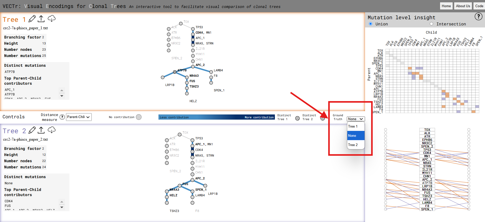
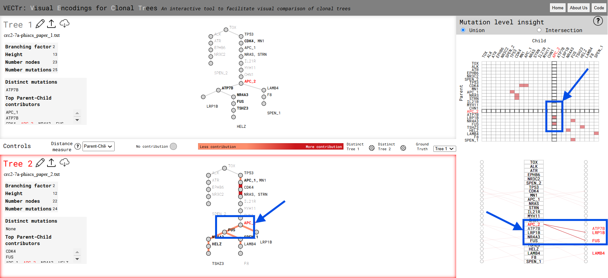

# Visual Encodings for Clonal Trees (VECTr) 

The work in this repository is described in a paper written by Thea Traw, Quoc Nguyen, Dr. Layla Oesper, and Dr. Eric Alexander.
Specifically, this repository contains a Flask server that the user can run to start the tool, auxiliary scripts, and also sample
input trees. 

Although it has undergone many changes since then, this tool ultimately 
first emerged as the capstone project of a group of students 
from the Computer Science Department of Carleton College, MN, 2022 2023. 
The names of these students are as follows...

- Sam Hiken
- Shakeal Hodge
- Josiah Misplon
- Quoc Nguyen
- Kanishk Pandey
- Jimmy Zhong

## Package Requirements

```
Flask==3.0.3
networkx==3.4.1
pydot==3.0.2
```

## Running VECTr

```
python3 combined_app_api.py localhost 5000
```

## Use cases

### Comparing against a ground-truth tree.

1. Upload each of your trees.

2. Select which tree to designate as the ground-truth. 



3. The ground-truth tree should now be demphasized in the node-link diagram and its relationships removed from the tripartite and heatmap. Only extraneous parental/ancestral relationships found in the non ground-truth tree are represented. For example, the (APC_2, FUS) relationship is not found in the ground-truth tree, so its edge is colored in red in Tree 2, the non ground-truth tree in this example.  



